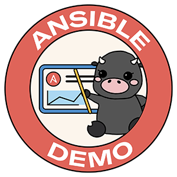

# AWS EC2 Operational Tasks

This Ansible Project showcase multiple AWS (Amazon Web Services) operational tasks fully automated with Ansible Playbooks.

An operational tasks is a routine task an operator (cloud administer) has to do outside of provisioning and deprovisioning resources.  Declarative automation (such as AWS CloudFormation templates) are great until someone manually, or some tool outside of CloudFormation starts interacting with the public cloud.  There is always use cases for imperative repeatable tasks that operators are doing manually.

# Glossary of AWS terms

**ec2** - Amazon Elastic Compute Cloud, Secure, resizable compute capacity in the cloud.

**ec2 region** - Amazon cloud computing resources are hosted in multiple locations world-wide. These locations are composed of AWS Regions, Availability Zones, and Local Zones. Each AWS Region is a separate geographic area. Each AWS Region has multiple, isolated locations known as Availability Zones. [read more here](https://docs.aws.amazon.com/AmazonRDS/latest/UserGuide/Concepts.RegionsAndAvailabilityZones.html)

**ec2 instance** - Any compute deployment within the Amazon EC2 service.

**tag** -  metadata for AWS resources. Each tag is a simple label consisting of a customer-defined key and an optional value that can make it easier to manage, search for, and filter resources by purpose, owner, environment, or other criteria. AWS tags can be used for many purposes.

# Ansible Playbook Examples

## Retrieve and Stop

`playbooks/stop_instances.yaml` [link](playbooks/stop_instances.yaml)


```yaml
ansible-playbook stop_instances.yaml -e "your_region=us-west-1"
```

This Ansible Playbook will retrieve all instances from the specified region `us-west-1` and stop them.

## Turn long-running instances off

`playbooks/turn_off_time.yaml` [link](playbooks/turn_off_time.yaml)


```yaml
ansible-playbook turn_off_time.yaml -e "your_region=us-west-1 kill_time=100"
```

This Ansible Playbook will retrieve all instances from the specified region `us-west-1` that have been running over 100 minutes, then stop them.

## Turn untagged instances off

`playbooks/no_tags.yaml` [link](playbooks/no_tags.yaml)


```yaml
ansible-playbook no_tags.yaml -e "your_region=us-west-1"
```

This Ansible Playbook will retrieve all instances from the specified region `us-west-1` that have no tags, and stop them. No tags means literally they have zero tags, not a single tag.  It is not looking for a specific tag.

## Retrieve instances without a specific tag

`playbooks/missing_tag.yaml` [link](playbooks/missing_tag.yaml)


```yaml
ansible-playbook missing_tag.yaml -e "your_region=us-west-1"
```

This Ansible Playbook will retrieve all instances from the specified region `us-west-1` that don't have the specific tag key `owner` (e.g. tags.owner).  This allows an operator to enforce a specific tag (e.g. assign an owner to each resource in this example) or it will be [scheduled](https://docs.ansible.com/ansible-tower/latest/html/userguide/scheduling.html) in Ansible Automation Platform to be turned off.

## Put instances to sleep

`playbooks/sleep_schedule_off.yaml` [link](playbooks/sleep_schedule_off.yaml)


```yaml
ansible-playbook sleep_schedule_off.yaml -e "your_region=us-west-1"
```

This Ansible Playbook will retrieve all instances from the specified region `us-west-1` that have the specific tag key pair `sleep_schedule: true`.  This allows operators to optionally add a tag to their instances, to turn them off at night.  This Ansible Playbook would be [scheduled](https://docs.ansible.com/ansible-tower/latest/html/userguide/scheduling.html) in Ansible Automation Platform to run every evening at a specific time.  In a multi-region scenario this could be enhanced with timezones to allow operators to specify their timezone or working hours.

## Wake up sleepy instances

`playbooks/sleep_schedule_on.yaml` [link](playbooks/sleep_schedule_on.yaml)


```yaml
ansible-playbook sleep_schedule_on.yaml -e "your_region=us-west-1"
```

This Ansible Playbook will retrieve all instances from the specified region `us-west-1` that have the specific tag key pair `sleep_schedule: true`.  This allows operators to optionally add a tag to their instances, to turn them on in the morning (opposite of previous example, please see above for more information).

# Ansible Demos



This project is maintained by Red Hat.  

- For more information on Ansible Automation please visit
[https://www.ansible.com/](https://www.ansible.com/)
- For more Ansible Automation Platform demos, please visit
[https://github.com/ansible/product-demos](https://github.com/ansible/product-demos)
- Please consider subscribing to us on YouTube: 
[https://youtube.com/ansibleautomation](https://youtube.com/AnsibleAutomation)
